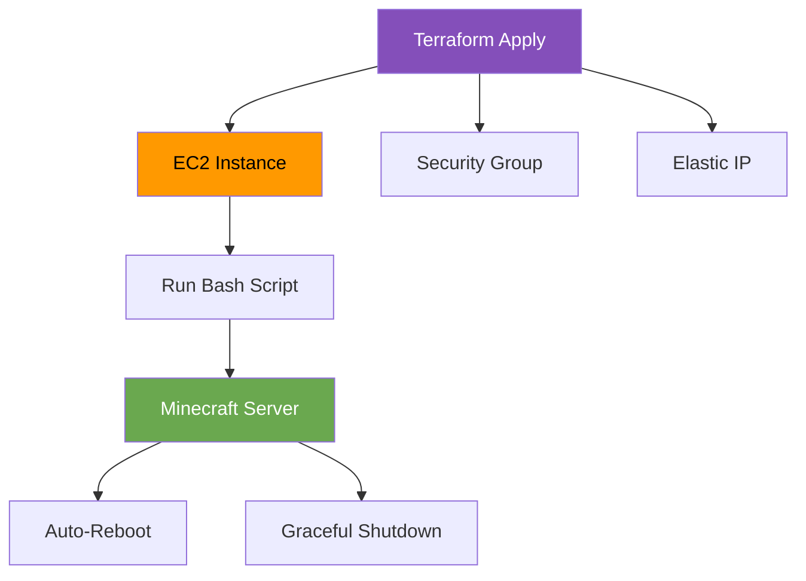

# CS312-CourseProjectPart2
AWS Minecraft Server through scripting

## Background
This repository is designed to automate the provisioning and configuration of a minecraft server on an EC2 instance on AWS through Terraform and Bash scripiting.

The repository consists of mostly terraform code, which also transfers a bash script to the server which gets run to provision the server. 

### Features
- Automatically provisions an EC2 instance, security group, key pair (using exisiting key pair), and more.
- Auto reboot upon server shutdown and restart.
- Elastic IP Address such that IP Address never changes between reboots.
- Graceful shut down with SIGTERM, with timeout before sending SIGKILL.

### Tools
- Git: 2.47.1.windows.2
- AWS CLI: 2.27.33
- Terraform: Version 1.12.1

## Detailed Instructions: 
This code should be able to be run on either Windows or Linux. I ran the code on Windows. 

### Pipeline Diagram:
IMPORTANT NOTE: Diagram only supported by some md translators. Please view on Github if needed. 

### Prerequisites: 
- git
  - https://git-scm.com/downloads
- terraform
  - https://developer.hashicorp.com/terraform/tutorials/aws-get-started/install-cli 
  - https://developer.hashicorp.com/terraform/install
- AWS CLI: Not necessarily required, but helpful
  - https://docs.aws.amazon.com/cli/latest/userguide/getting-started-install.html
- PATH:
  - Ensure that git, terraform, and aws are in your PATH.
  - Use [this](https://www.architectryan.com/2018/03/17/add-to-the-path-on-windows-10/) if you need help.

### Instructions

#### Configuration
1. Clone the git repository onto your machine using a method of your liking.
2. Get your AWS credentials and add them to [/.aws/credentials](/.aws/credentials).
    - If you already have your credentials somewhere else (such as `~/.aws/credentials`) you can use those instead, just follow the additonal step in [provisioning](#provisioning).
3. If needed, update SERVER_JAR_URL in [/bash/setup.sh](/bash/setup.sh) to the most recent.
    - The currently used link is: https://piston-data.mojang.com/v1/objects/e6ec2f64e6080b9b5d9b471b291c33cc7f509733/server.jar.
    - The link to find the most recent is located [here](https://www.minecraft.net/en-us/download/server).
4. Create a public private key pair and add it to [/.ssh/](/.ssh).
    - Open a command prompt and navigate to [/.ssh/](/.ssh).
    - Run the command `ssh-keygen -t rsa -b 4096 -f /minecraft_key -C "minecraft server key"`.
    - Ensure you name the key `minecraft_key` (there should be to files, `minecraft_key` and `minecraft_key.pub`) for the script to run properly. 

#### Provisioning
1. Open a command prompt and navigate to [/terraform/](/terraform).
2. Run `terraform init`.
   - This sets up terraform and adds the files that are ignored by the .gitignore.
3. Run `terraform apply -auto-approve`.
    - If you changed the path to your aws credentials in the [configuration](#configuration) section, use this command instead `terraform apply -auto-approve -var "aws_credentials_path=[/YOURPATH]"`.
4. (Optional) If you ever wish to destroy the reosources, run `terraform destroy -auto-approve`

#### Connecting
After running, the terraform script will output the instance id, and the instance ip address. 
You can test the server by running: `nmap -sV -Pn -p T:25565 [IP ADDRESS]`
You should now be able to connect to the server on minecraft:
1. Boot up Minecraft
    * **Important**: Ensure the version you launch is the same version as the server you downloaded
2. Click "Multiplayer" and then "Add Server"
3. Name the server something meaningful and put your IP Address, output by terraform
4. Click "Done" and you should be able to connect to your server.

## Resources:
Minecraft Server Page: https://www.minecraft.net/en-us/download/server  
Setting up Terraform: https://developer.hashicorp.com/terraform/tutorials/aws-get-started/install-cli  
AWS CLI: https://docs.aws.amazon.com/cli/latest/userguide/getting-started-install.html  
EULA
AI Used for debugging